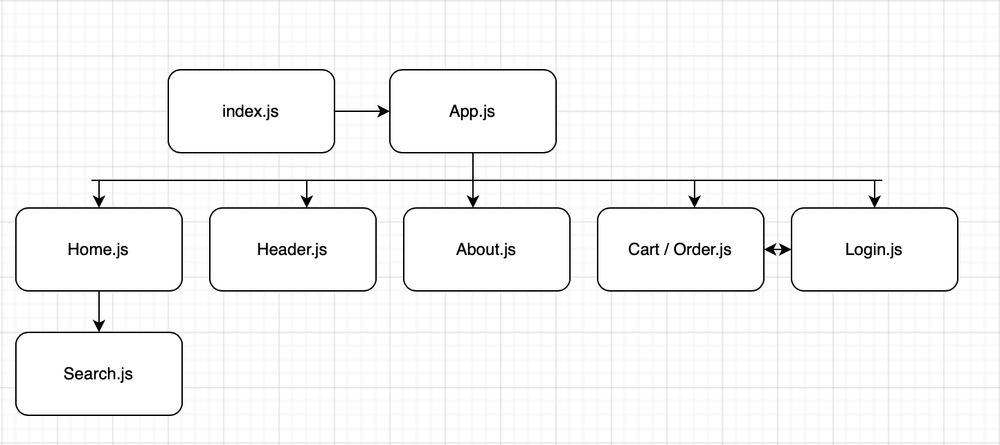
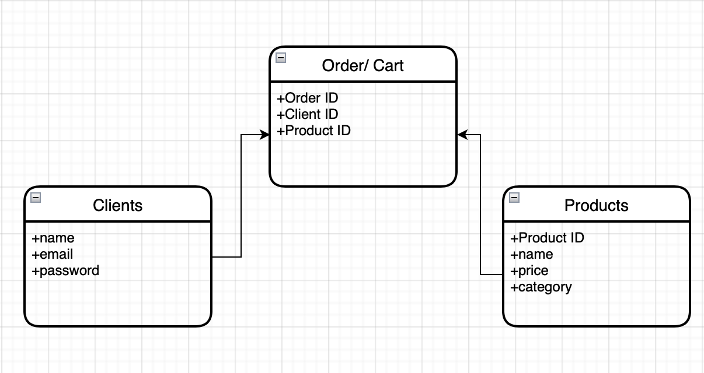

# h-online-store

## Date: 07/24/2022

### By: Hyeree Park

[Website](http://www.duckduckgo.com) | [GitHub](https://github.com/Hp2240) | [LinkedIn](https://www.linkedin.com/in/hyeree-park94/)

---

### **_Hosted Site_**

[h-online-store]()

---

### **_Description_**

This website is an online clothing store for women that allows clients to interact with the pages. Clients are able to request orders.

### **_Technologies To Use_**

- React
- Express
- Mongo / Mongoose
- CSS

---

### **_Getting Started_**

TBD

---

### **_Screenshots_**

App Architecture

ERD

### **_Credits_**

##### Source: [1](http://g-use.com)

---

### **_Trello Board_**

[Hyeree's Project 1](https://trello.com/b/S3kimaQA/project-2-ga)
